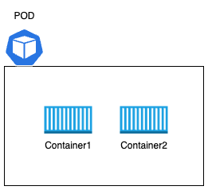
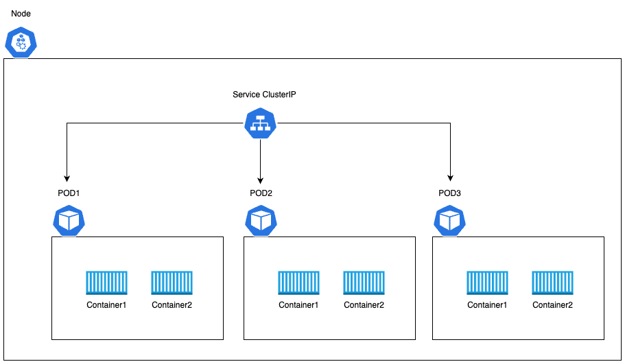
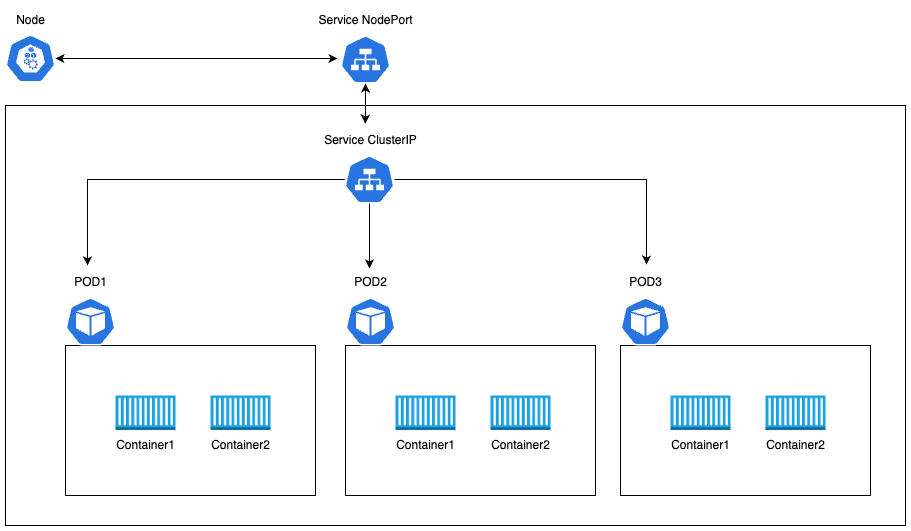
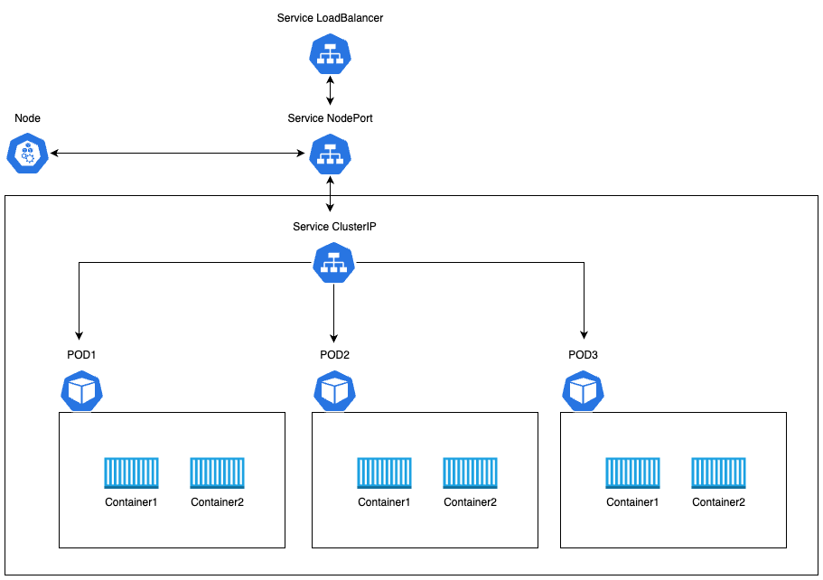
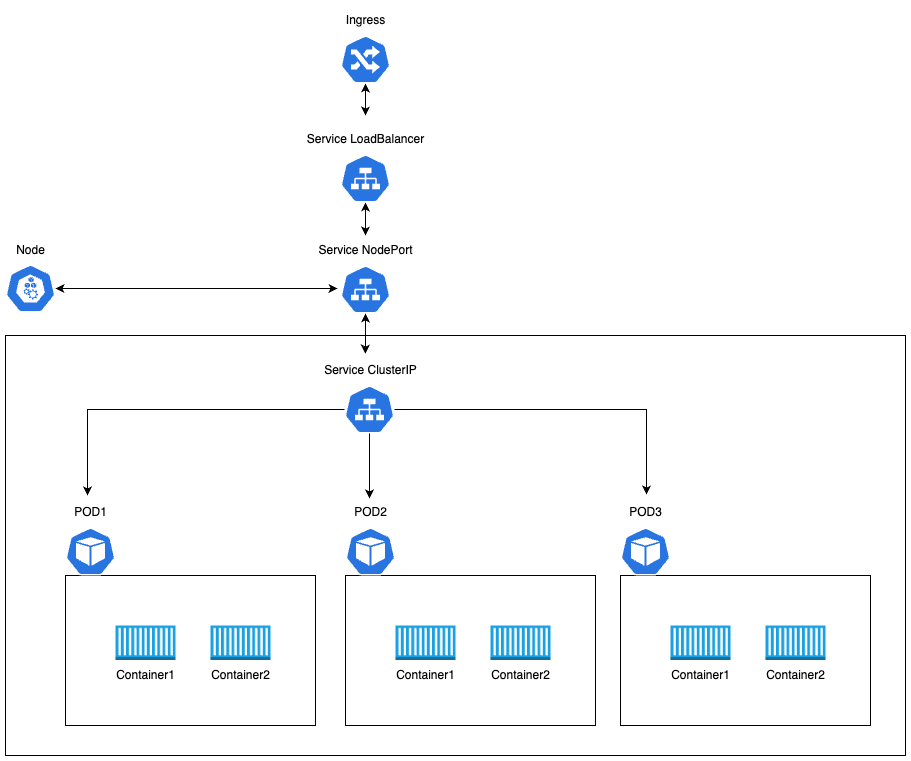
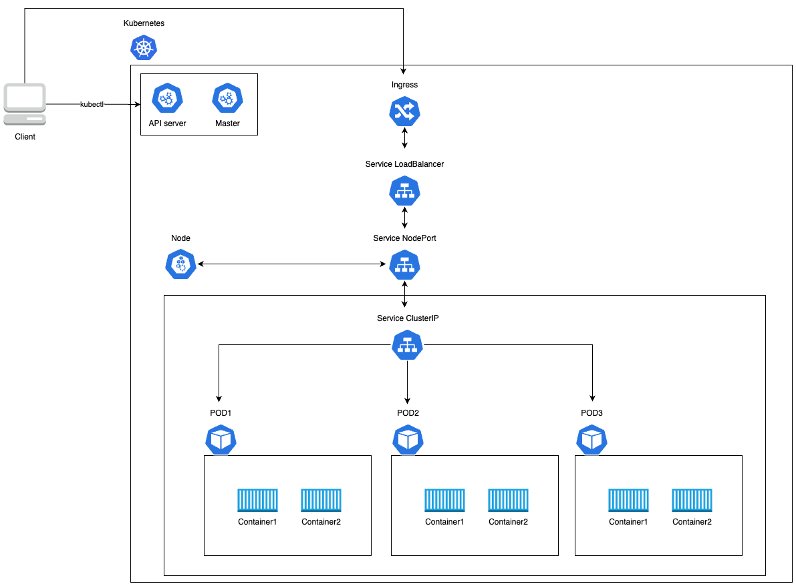

# POD とは

POD : 1 つ以上の container を管理する k8s 上の単位
|  |
| :-------------------: |

アプリケーションの可用性を向上させるためには、POD 内のコンテナを増設するのではなく、POD を複数作成する必要がある。

# Service とは

## ClusterIP

|  |
| :-------------------------: |

## NoderPort

|  |
| :------------------------: |

## LoadBalancer

|  |
| :----------------------------: |

## Ingress

|  |
| :-----------------------: |

# Kubernetes 全体図

|  |
| :-------------------: |
