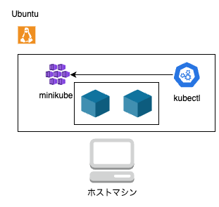

# はじめに

今回は、K8S の学習をする上で、クラウドのサービスを使わずに環境構築する方法を紹介します。

そもそも minikube とは、K8S をローカル上で実行することができるサービスのことで、kubectl とは、コマンド上でクラスタの操作を行うことができるアプリケーションです。

|  |
| :-------------------------------: |

# minikube

以下コマンドでインストールできます。

```
curl -LO https://github.com/kubernetes/minikube/releases/latest/download/minikube-linux-amd64
sudo install minikube-linux-amd64 /usr/local/bin/minikube && rm minikube-linux-amd64
```

以下コマンドで minikube をスタートできます。

```
minikube start
```

# kubectl

以下で kubectl の準備ができます。

```
curl -LO "https://dl.k8s.io/release/$(curl -L -s https://dl.k8s.io/release/stable.txt)/bin/linux/amd64/kubectl"

curl -LO "https://dl.k8s.io/release/$(curl -L -s https://dl.k8s.io/release/stable.txt)/bin/linux/amd64/kubectl.sha256"

echo "$(cat kubectl.sha256)  kubectl" | sha256sum --check

sudo install -o root -g root -m 0755 kubectl /usr/local/bin/kubectl

kubectl version --client
```

# 参考文献

https://minikube.sigs.k8s.io/docs/start/?arch=%2Fmacos%2Farm64%2Fstable%2Fbinary+download

https://kubernetes.io/ja/docs/tasks/tools/install-kubectl-linux/
